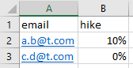

# Unit Test Practice

This is an area to practice unit-testing in times of high dependency.

## The Opportunity

With all the reuse possible today, a little code can achieve a lot.
Of course, this comes with a lot of dependency on the re-used code.
Unit tests focus on isolating our code from dependencies.
However,
the functionality can feel 'empty' after removing dependencies.
The resulting unit-tests may not give confidence about real-life behavior.

The opportunity is to sustain confidence in small pieces of code
with fast feedback from unit tests.

## Our Playground

Let's say our product needs to read [this excel](emails-to-send.xlsx):

And then send email information to employees about their hike.

Is it easy to read this excel file?
See [this file](read_excel_poc.py) for an implementation.
It reads `emails-to-send.xlsx` and prints the data -
it's a couple of lines of code.

### Code-driven play

[This file](test_read_isolated.py) is an attempt
to test the functionality without dependencies.
It uses mocking to remove the dependency on pandas, excel and the file-system.
The mock returns predefined sample data.

By the way, we've made the implementation testable
by returning the result instead of printing it.
This makes the behavior 'observable' by an automated test,
rather than a human having to check the console every time.

The [sample data](https://github.com/Engin-Boot/consumer-driven-unit-tests/blob/main/test_read_isolated.py#L7-L9)
used in the test is interesting.
It gives readable percentages, like in the excel.
That was not the case when the data actually came from the excel!

Did the unit test deviate from reality? Did it 'hide' the real behavior?
Does this give us confidence? Can we do better?

### Consumer-driven play

In this approach, we build tests to safeguard our consumer's value.
What can upset them? What can engage them?

## Exercise-1

Think of a simple unit test to check the presence of a '%'
and match content entered in the file.
Think of the test as a precise statement of customer-need.
Enter your test (in English or Python) [here](test_hike_content.py)

## Exercise-2

Design unit-tests to catch possible human-errors in data-entry.
Put your thoughts [here](test_data_load.py)
